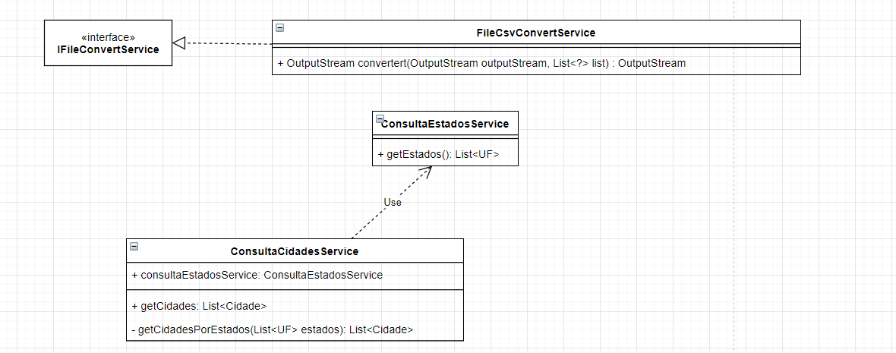

# Consulta Cidade API

# Ferramentas utilizadas para desenvolvimento da solução 

* Java 11
* Springboot 2.3
* Maven
* REST Assured - Teste (http://rest-assured.io/)
* Swagger - Documentação api (https://swagger.io/)

# Models

# Serviços

# Instruções

# PORTA

8080

# RUN

1 - mvn install / mvn clean install 
2 - mvn spring-boot:run

# TESTE

1 - mvn test

# Endpoints

/api/cidades/csv 
/api/cidades/json 
/api/cidades/{nomeCidade}

# Swagger 

/swagger-ui.html

